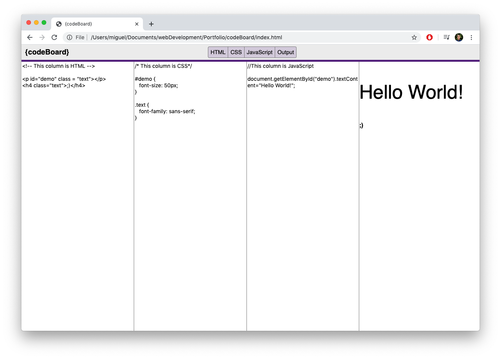

# codeBoard: A shameless JS Bin clone.
by mrivasperez. live demo: <https://mrivasperez.github.io/codeBoard/>
## Screenshot

## Description
{codeBoard} ("codeBoard") is an online text editor built with to help others test their code with live editing features. Since there is no method to save your work on this website, it is best for a developer that is just learning to code and needs a place to code with minimal bells and whistles. If your JavaScript code is not running correctly, codeBoard will not let you know what is wrong. You will have you work on mastering the code!

This app was built using HTML, CSS, Vanilla JS, and jQuery (compressed, production) 3.4.1

## Installation
To install codeBoard, download the files as a zip file. Create a new folder in your system and drag and drop contents of the zip file to that folder. Double click "index.html" to begin using codeBoard. If you wish to view the heavily commented JS file to learn how I built it using jquery "script.js" using your preferred text editor.

## How to use
### Getting started
The user interface of codeBoard is very similar to JS Bin (https://jsbin.com/). It initially greets you with a two column interface. The left column is for HTML and the right column is the Output of your code. 
### How to view or hide panels
In the middle of the navigation bar at the top there are four buttons you can press to toggle which panels are in view. To view or hide any panel, you must click the respective panel. You can tell which panels are active by looking at the navigation panels. When a panel is active the button corresponding to it will be a light purple.

## License
